# Diagrama Arquitectónico - Aplicación de Banca Móvil

## Arquitectura Cloud Híbrida con Funciones Serverless

```mermaid
graph TB
    %% Cliente Móvil
    subgraph "Cliente Móvil"
        MA[Mobile App iOS/Android]
        WA[Web App React/Angular]
    end

    %% Cloud Público - AWS
    subgraph "AWS Cloud Público"
        %% API Gateway
        AG[API Gateway]
        
        %% Funciones Lambda
        subgraph "Funciones Serverless"
            AL[Auth Lambda<br/>Autenticación]
            BL[Banking Lambda<br/>Operaciones Bancarias]
            NL[Notifications Lambda<br/>Notificaciones & Auditoría]
        end
        
        %% Base de Datos
        subgraph "Almacenamiento"
            DDB[(DynamoDB<br/>Usuarios, Sesiones<br/>Transacciones)]
            RDS[(RDS PostgreSQL<br/>Datos Transaccionales)]
            REDIS[(ElastiCache Redis<br/>Cache & Sesiones)]
        end
        
        %% Servicios de Mensajería
        subgraph "Mensajería"
            SQS1[SQS Transaction Queue]
            SQS2[SQS Notification Queue]
            SQS3[SQS Audit Queue]
            SNS1[SNS Push Notifications]
            SNS2[SNS Email Notifications]
        end
        
        %% Monitoreo y Logs
        subgraph "Monitoreo"
            CW[CloudWatch Logs]
            CT[CloudTrail]
            XR[AWS X-Ray]
        end
        
        %% Seguridad
        subgraph "Seguridad"
            KMS[AWS KMS<br/>Encriptación]
            COGNITO[AWS Cognito<br/>Autenticación]
            WAF[AWS WAF<br/>Protección Web]
        end
    end

    %% Infraestructura Privada/Híbrida
    subgraph "Infraestructura Privada"
        subgraph "Data Center Local"
            LD[Legacy Database<br/>Sistemas Core Banking]
            FS[File Storage<br/>Documentos]
            MS[Mainframe Systems<br/>Procesamiento Batch]
        end
        
        subgraph "Cloud Privado"
            PV[Private VPC<br/>Recursos Sensibles]
            VPN[VPN Gateway<br/>Conexión Segura]
        end
    end

    %% Servicios Externos
    subgraph "Servicios Externos"
        PSP[Payment Service Providers<br/>Visa, Mastercard]
        SMS[SMS Gateway<br/>Notificaciones SMS]
        EMAIL[Email Service<br/>SendGrid, SES]
        PUSH[Push Notification Service<br/>FCM, APNS]
    end

    %% Conexiones Cliente
    MA --> AG
    WA --> AG
    
    %% API Gateway a Lambdas
    AG --> AL
    AG --> BL
    AG --> NL
    
    %% Lambdas a Base de Datos
    AL --> DDB
    AL --> REDIS
    BL --> DDB
    BL --> RDS
    BL --> REDIS
    NL --> DDB
    
    %% Lambdas a Colas
    BL --> SQS1
    NL --> SQS2
    NL --> SQS3
    
    %% Colas a Servicios
    SQS1 --> BL
    SQS2 --> NL
    SQS3 --> NL
    
    %% Notificaciones
    NL --> SNS1
    NL --> SNS2
    SNS1 --> PUSH
    SNS2 --> EMAIL
    
    %% Monitoreo
    AL --> CW
    BL --> CW
    NL --> CW
    AG --> CT
    AL --> XR
    BL --> XR
    NL --> XR
    
    %% Seguridad
    AL --> COGNITO
    AL --> KMS
    BL --> KMS
    NL --> KMS
    AG --> WAF
    
    %% Conexiones Híbridas
    BL -.->|API Calls| LD
    BL -.->|File Access| FS
    NL -.->|Batch Processing| MS
    
    %% Conexiones Externas
    BL -.->|Payment Processing| PSP
    NL -.->|SMS Notifications| SMS
    
    %% Estilos
    classDef aws fill:#ff9900,stroke:#232f3e,stroke-width:2px,color:#fff
    classDef lambda fill:#ff6b6b,stroke:#333,stroke-width:2px,color:#fff
    classDef database fill:#4ecdc4,stroke:#333,stroke-width:2px,color:#fff
    classDef private fill:#6c5ce7,stroke:#333,stroke-width:2px,color:#fff
    classDef external fill:#a8e6cf,stroke:#333,stroke-width:2px,color:#333
    
    class AG,DDB,RDS,REDIS,SQS1,SQS2,SQS3,SNS1,SNS2,CW,CT,XR,KMS,COGNITO,WAF aws
    class AL,BL,NL lambda
    class LD,FS,MS,PV,VPN private
    class PSP,SMS,EMAIL,PUSH external
```



## Flujo de Datos Principal

### 1. Autenticación de Usuario
```
Mobile App → API Gateway → Auth Lambda → DynamoDB (Usuarios)
                              ↓
                         Cognito (JWT) → Redis (Sesión)
```

### 2. Operación Bancaria (Transferencia)
```
Mobile App → API Gateway → Banking Lambda → RDS (Verificar Saldo)
                              ↓
                         DynamoDB (Registrar Transacción)
                              ↓
                         SQS (Cola de Procesamiento)
                              ↓
                         Notification Lambda → SNS → Push/Email
```

### 3. Auditoría y Monitoreo
```
Todas las Operaciones → CloudTrail → S3 (Logs)
                              ↓
                         X-Ray (Trazabilidad)
                              ↓
                         CloudWatch (Métricas y Alertas)
```

## Componentes de Seguridad

### Capa de Aplicación
- **JWT Tokens**: Autenticación stateless
- **Encriptación**: Datos en tránsito y reposo
- **Rate Limiting**: Protección contra ataques DDoS

### Capa de Infraestructura
- **VPC**: Red privada virtual
- **Security Groups**: Firewall a nivel de instancia
- **WAF**: Protección web application firewall
- **KMS**: Gestión de claves de encriptación

### Capa de Datos
- **Encriptación en Reposo**: RDS, DynamoDB, S3
- **Encriptación en Tránsito**: TLS/SSL
- **Backup Encriptado**: Snapshots automáticos

## Escalabilidad y Disponibilidad

### Escalado Automático
- **Lambda**: Escalado automático por demanda
- **DynamoDB**: Escalado automático de capacidad
- **RDS**: Read replicas para consultas
- **Redis**: Cluster mode para alta disponibilidad

### Alta Disponibilidad
- **Multi-AZ**: Recursos distribuidos en múltiples zonas
- **Load Balancing**: Distribución de carga automática
- **Failover**: Conmutación automática en caso de fallo
- **Backup**: Respaldos automáticos y punto de recuperación

## Monitoreo y Observabilidad

### Métricas de Aplicación
- **Latencia**: Tiempo de respuesta de APIs
- **Throughput**: Transacciones por segundo
- **Error Rate**: Porcentaje de errores
- **Availability**: Tiempo de actividad

### Métricas de Infraestructura
- **CPU/Memory**: Utilización de recursos
- **Network**: Tráfico de red
- **Storage**: Uso de almacenamiento
- **Database**: Conexiones y consultas

### Alertas Automáticas
- **CloudWatch Alarms**: Alertas por umbrales
- **SNS Notifications**: Notificaciones por email/SMS
- **Auto Scaling**: Escalado automático basado en métricas


